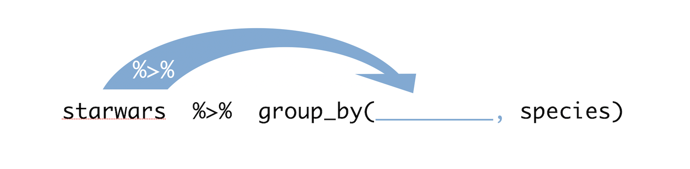

# (PART) The Recipes {-} 

# Program

***

This chapter includes the following recipes. To manipulate vectors with [purrr](http://purrr.tidyverse.org), see [Transform Lists and Vectors].

```{r echo = FALSE, results='asis'}
build_toc("01-program.Rmd")
```

***

## What you should know before you begin {-}

```{block2, type='rmdcaution'}
The [tidyverse](http://www.tidyverse.org) is a collection of R packages that are designed to work well together. There are about 25 packages in the tidyverse. An R package is a bundle of functions, documentation, and data sets. R has over 13,000 packages. These are not installed with R, but are archived [online](https://cran.r-project.org/web/packages/index.html) for when you need them. 

To use an R package, you must:
  
1. Install the package on your local machine with `install.packages()`. You only need to do this once per machine. 

2. Load the package into your R session with `library()`. You need to do this each time you start a new R session (if you wish to use the package in that session).

You cannot use the contents of a package until you load the package in your current R session. You should update your packages from time to time to receive the latest improvements from package authors.
```

```{block2, type='rmdcaution'}
Tidyverse functions are designed to be used with the `%>%` operator. `%>%` links R functions together to create a "pipe" of functions that are run in sequence: `%>%` passes the output of one function to the input of the next. `%>%` comes with the dplyr package, which imports it from the magrittr package. 
```

## Install a tidyverse package {#install}

You'd like to install a package that is in the tidyverse.

#### Solution {-}

```{r eval = FALSE}
install.packages("dplyr")
```

#### Discussion {-}

Tidyverse packages can be installed in the normal way with `install.packages()`. See `?install.packages` for installation details.

```{block2, type = "rmdcaution"}
By default, `install.packages()` will download packages from [https://cran.r-project.org](https://cran.r-project.org), or one of its mirrors---so be sure you are connected to the internet when you run it.
```

## Install all of the tidyverse packages {#install-all}

You'd like to install _all_ of the packages in the tidyverse with a single command.

#### Solution {-}

```{r include = FALSE}
install.packages("tidyverse", repo = "https://cloud.r-project.org")
```

```{r eval = FALSE}
install.packages("tidyverse")
```

#### Discussion {-}

The `tidyverse` package provides a shortcut for downloading all of the packages in the tidyverse. `tidyverse` purposefully lists every package in the tidyverse as one of its dependencies. This causes R to install all of the packages in the tidyverse when R installs `tidyverse`.

`install.packages("tidyverse")` will install the following packages:

```{r echo = FALSE}
tidyverse_packages()
```

## Load a tidyverse package {#load}

You want to load a package that is in the tidyverse, so that you can use its contents. You've already [installed](#install) the package on your computer.

#### Solution {-}

```{r eval = FALSE}
library("dplyr")
```

#### Discussion {-}

You can load individual tidyverse packages with `library()`. The package will stay loaded until you end your R session or run `detach()` on the package. If you begin a new R session, you will need to reload the package in the new session with `library()`.

```{block2, type = "rmdcaution"}
`library()` cannot load packages that have not been [installed](#install) on your machine.
```

```{block2, type = "rmdcaution"}
You must place quotation marks around a package name when you use `install.packages()`, but the same is not true for `library()`. The commands below will both load the dplyr package if it is installed on your computer. 
  
    library(dplyr)
    library("dplyr")

```

## Load the core set of tidyverse packages

You would like to load the most used packages in the tidyverse with a single command. You've already [installed](#install-all) these packages on your computer.

#### Solution {-}

```{r results='hide', message = FALSE, warning = FALSE}
library("tidyverse")
```

#### Discussion {-}

When you load the `tidyverse` package, R will also load the following packages:

- `ggplot2`
- `dplyr`
- `tidyr`
- `readr`
- `purrr`
- `tibble`
- `stringr`
- `forcats`

These eight packages are considered the "core" of the tidyverse because:

1. They are the most used tidyverse packages.
1. They are often used together as a set (when you use one of the packages, you tend to also use the others).

You can still load each of these packages individually with `library()`. 

```{block2, type = "rmdcaution"}
Notice that `library("tidyverse")` does not load every package installed by `install.packages("tidyverse")`. You must use `library()` to individually load the "non-core" tidyverse packages.
```

## Update a tidyverse package {#update}

You want to check that you have the latest version of a package that is in the tidyverse. 

#### Solution {-}

```{r eval = FALSE}
update.packages("dplyr")
```

#### Discussion {-}

`update.packages()` compares the version number of your local copy of a package to the version number of the newest version available on CRAN. If your local copy is older than the newest version, `update.packages()` will download and install the newest version from CRAN. Otherwise, `update.packages()` will do nothing.

```{block2, type = "rmdcaution"}
Be sure that you are connected to the internet when you run `update.packages()`.
```

## Update all of the tidyverse packages {#update-all}

You want to check that you have the latest version of _every_ package that is in the tidyverse.

#### Solution {-}

```{r eval= FALSE}
tidyverse_update()
```

#### Discussion {-}

`tidyverse_update()` checks whether or not each of your tidyverse packages is [up-to-date](#update). If every package is up-to-date, `tidyverse_update()` will return the message: `All tidyverse packages up-to-date`. Otherwise, `tidyverse_update()` will return a piece of code that you can copy and run to selectively update only those packages that are out-of-date.

## List all of the tidyverse packages

You want to generate a vector that contains the names of every package in the tidyverse.

#### Solution {-}

```{r}
tidyverse_packages()
```

#### Discussion {-}

`tidyverse_packages()` returns a character vector that contains the names of every package that was in the tidyverse when you installed the `tidyverse` package. These are the packages that were installed onto your machine along with the `tidyverse` package. They are also the packages that [`tidyverse_update()`](#update-all) will check.

[Update](#update) the `tidyverse` package before running `tidyverse_packages()` to receive the most current list.

## Create an object

You want to create an object that stores content to use later.

#### Solution {-}

```{r}
x <- 1
```

#### Discussion {-}

The assignment operator is made by a less than sign, `<`, followed by a minus sign `-`. The result looks like an arrow, `<-`. R will assign the contents on the right hand side of the operator to the name on the left hand sign. Afterwards, you can use the name in your code to refer to the contents, e.g. `log(x)`.

Names cannot begin with a number, nor a special character like `^`, `!`, `$`, `@`, `+`, `-`, `/`, or `*`. 

```{block2, type = "rmdcaution"}
If you assign to a name that is already in use, the new content will mask or overwrite the previous object.
```

## Create a vector

You want to create a one-dimensional, ordered set of values.

#### Solution {-}

```{r}
c(3, 1, 7, 5)
```

#### Discussion {-}

The concatenate function, `c()`, combines its arguments into a vector that can be passed to a function or assigned to an object. To name each value, provide names to the arguments of `c()`, e.g. 

```{r}
c(mu = 3, chi = 1, psi = 7, pi = 5)
```


## See an object

You want to see the contents of an object.

#### Solution {-}

```{r}
x
```

#### Discussion {-}

R displays the contents of an object when you call the bare object name—not surrounded with quotation marks, not followed by parentheses. This works for functions too, in which case R displays the code elements assigned to the function name,e.g. `lm`.

## Remove an object

You want to remove an object that you have created.

#### Solution {-}

```{r}
rm(x)
```

#### Discussion {-}

The remove function, `rm()`, removes an object from R's memory. `rm()` will not remove an object that is loaded from an R package.

## Call a function

You want to call a function, i.e. you want R to execute a function.

#### Solution {-}

```{r}
round(3.141593, digits = 2)
```

#### Discussion {-}

To run a function, type its name followed by an open open and closed parentheses. If the function requires arguments (i.e. inputs) to do its job, place the arguments between the parentheses. 

It is a best practice to name every argument after the first. This is sometimes relaxed to every argument after the second argument, if the second argument is also obvious and required.


## See a function's arguments

You want to see which arguments a function uses/recognizes.

#### Solution {-}

```{r}
args(round)
```

#### Discussion {-}

`args()` displays the argument names of a function. Ignore the `function`, `(`, `)`, and `NULL` in the output. Each argument name will be listed between the parentheses. 

If an argument has a default value, the value will appear next to its name, as in `digits = 0`. Arguments that have default values are optional: the function will use the default value when you do not supply a different value for that argument. Arguments without default values must be supplied when you run the function to avoid an error.


## Open a function's help page

You want to open the help page for a function.

#### Solution {-}

```{r}
?round
```

#### Discussion {-}

To open a function's help page, run a `?` followed by the bare function name—no parentheses or quotes. A function's help page is the technical documentation for the function and its arguments. Often the most useful section of a help page is the last, which is an examples section of code that uses the function.

```{block2, type = "rmdcaution"}
A function's help page is loaded with the function. It will only be available if the package that contains the function is loaded.
```


## Combine functions into a pipe

You want to chain multiple functions together to be run in sequence, with each function operating on the preceding function's output.

#### Solution {-}

```{r}
starwars %>% 
  group_by(species) %>% 
  summarise(avg_height = mean(height, na.rm = TRUE)) %>% 
  arrange(avg_height)
```

#### Discussion {-}

The `%>%` operator (pronounced "pipe operator") evaluates the code on its left hand side (LHS) and then passes the result to the the code on its right hand side (RHS), which should be a function call. By default `%>%` will pass the result of the LHS to the first unnamed argument of the function on the RHS.

```{r echo = FALSE}

```


So `starwars %>% group_by(species)` is the equivalent of `group_by(starwars, species)`, and the above solution is the equivalent of the nested code:

```{r eval = FALSE}
arrange(
  summarise(
    group_by(starwars, species), 
    avg_height = mean(height, na.rm = TRUE)
  ), 
  avg_height
)
```

or the equivalent of:

```{r eval = FALSE}
x1 <- starwars 
x2 <- group_by(x1, species)
x3 <- summarise(x3, avg_height = mean(height, na.rm = TRUE))
arrange(x3, avg_height)
```

The chunk of functions connected by `%>%` is called a "pipe." To read a pipe as a sequence of steps, mentally pronounce `%>%` as "then."

The `%>%` operator is loaded with the dplyr package, which imports it from the magrittr package. Tidyverse functions facilitate using `%>%` by 

1. accepting a data frame or tibble as their first argument
2. returning a data frame or tibble as their result

```{block2, type = "rmdcaution"}
`%>%` is easy to type in the RStudio IDE with the keyboard shortcuts 

* **Command + Shift + M** (Mac OS)
* **Control + Shift + M** (Windows)
```


## Pipe a result to a specific argument

You want to use `%>%` to pass the result of the left hand side to an argument that is not the first argument of the function on the right hand side.

#### Solution {-}

```{r}
starwars %>% 
  lm(mass ~ height, data = .)
```

#### Discussion {-}

By default `%>%` passes the result of the left hand side to the the first unnamed argument of the function on the right hand side. To override this default, use `.` as a placeholder within the function call on the right hand side. `%>%` will evaluate `.` as the result of the left hand side, instead of passing the result to the first unnamed argument.

The solution code is the equivalent of 

```{r eval = FALSE}
lm(mass ~ height, data = starwars)
```

<!--

Change an object in place with a pipe

You want to manipulate a data set and then assign the resulting data set back to its original object. You don't want to repeat the name of the object twice. For example:

```{r eval = FALSE}
starwars <- starwars %>%
    group_by(species) %>%
    summarise(avg_height = mean(height, na.rm = TRUE))
```

#### Solution {-}

```{r eval = FALSE}
starwars %<>%
    group_by(species) %>% 
    summarise(avg_height = mean(height, na.rm = TRUE))
```


#### Discussion {-}

The `%<>%` operator (pronounced "compound assignment operator")  is used to update a variable by first piping it into one or more right hand side expressions (ex. `group_by` and `summarise`), and then assigning the result back into the object.

It saves you the extra step of typing the assignment operator and the variable name again. 

```{block2, type = "rmdcaution"}
Overwriting your original object is a bad idea if you haven't created a backup copy of your unmodified data somewhere else.
```

The authors of the [R for Data Science](https://r4ds.had.co.nz/) present a contrary opinion to the  compound assignment operator. 

> I’m not a fan of this operator because I think assignment is such a special operation that it should always be clear when it’s occurring. In my opinion, a little bit of duplication (i.e. repeating the name of the object twice) is fine in return for making assignment more explicit.

What this boils down to is a tradeoff between writing concise code (`%<>%`) or readable and clear code (repeating the name of the object twice with `%>%`).
```
-->