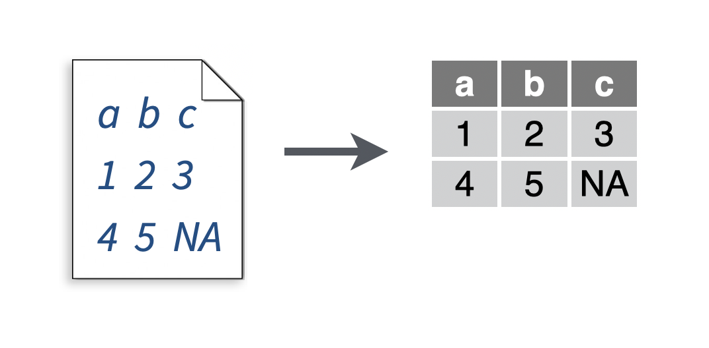
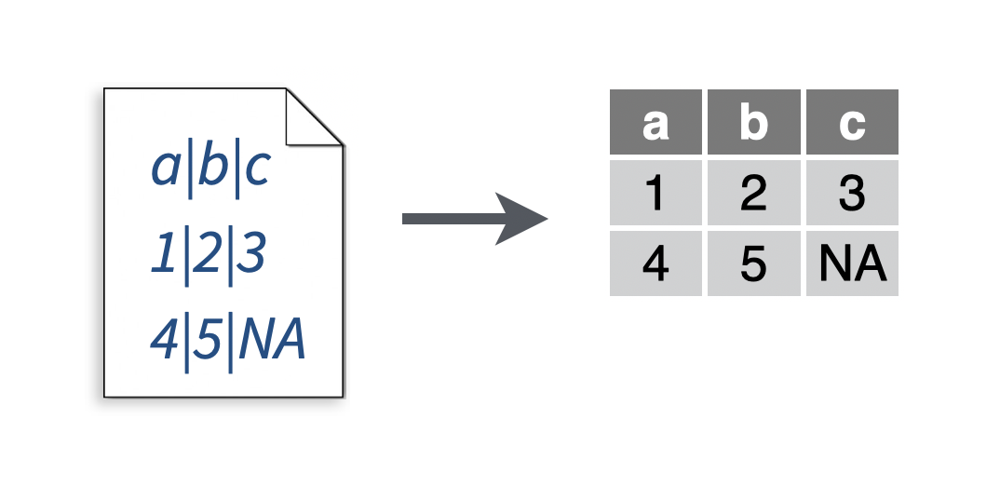
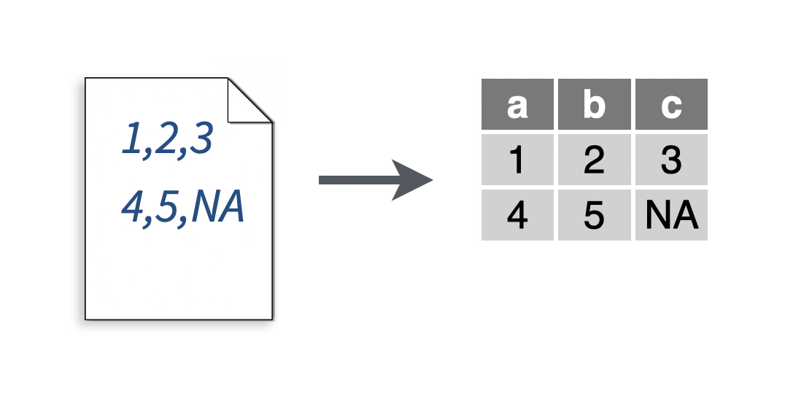
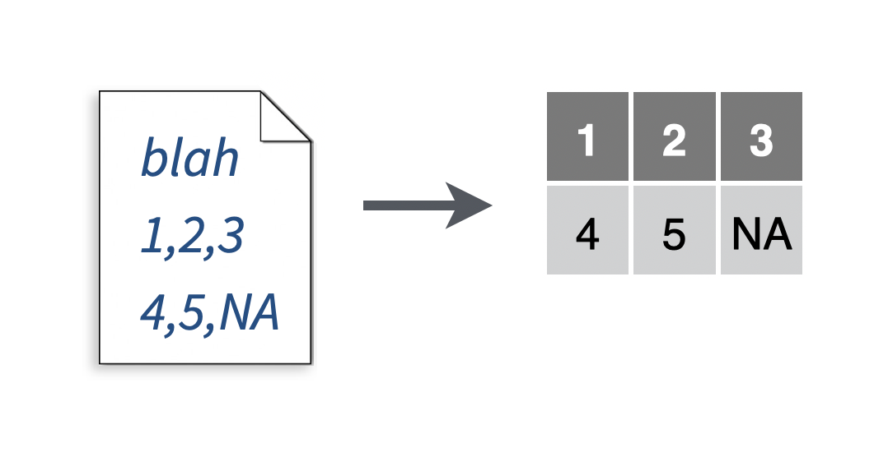
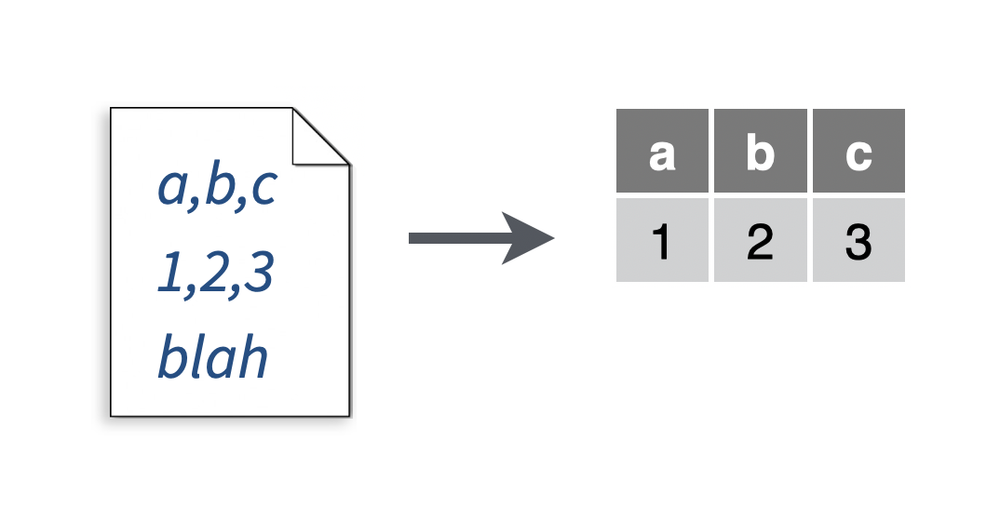
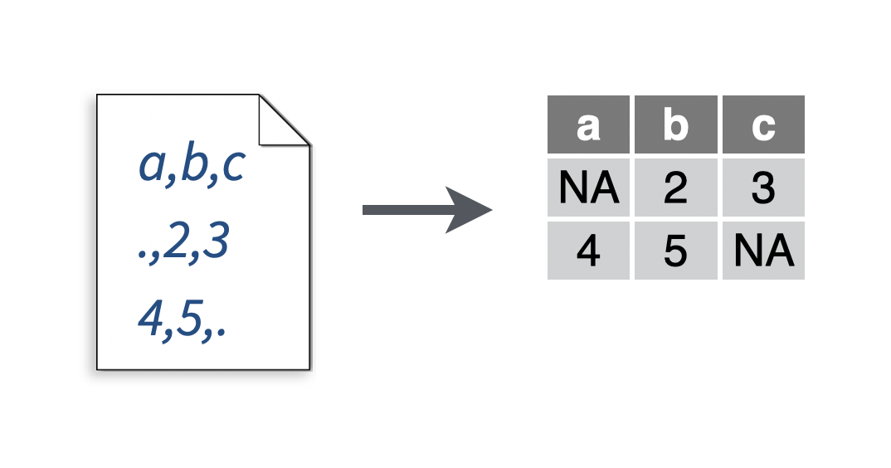

# Import

***

This chapter includes the following recipes:

```{r echo = FALSE, results='asis'}
build_toc("02-import.Rmd")
```

***

## What you should know before you begin {-}

```{block2, type='rmdcaution'}
Before you can manipulate data with R, you need to import the data into R's memory, or build a connection to the data that R can use to access the data remotely. For example, you can build a connection to data that lives in a database.

How you import your data will depend on the format of the data. The most common way to store small data sets is as a plain text file. Data may also be stored in a proprietary format associated with a specific piece of software, such as SAS, SPSS, or Microsoft Excel. Data used on the internet is often stored as a JSON or XML file. Large data sets may be stored in a database or a distributed storage system.

When you import data into R, R stores the data in your computer's RAM while you manipulate it. This creates a size limitation: truly big data sets should be stored outside of R in a database or a distributed storage system. You can then create a connection to the system that R can use to access the data without bringing the data into your computer's RAM. 

The readr package contains the most common functions in the tidyverse for importing data. The readr package is loaded when you run `library(tidyverse)`. The tidyverse also includes the following packages for importing specific types of data. These are not loaded with `library(tidyverse)`. You must load them individually when you need them. 

* DBI - connect to databases
* haven - read SPSS, Stata, or SAS data
* httr - access data over web APIs
* jsonlite - read JSON
* readxl - read Excel spreadsheets
* rvest - scrape data from the web
* xml2 - read XML

### The working directory

Reading and writing files often involves the use of file paths. If you pass R a partial file path, R will append it to the end of the file path that leads to your _working directory_. In other words, partial file paths are interpretted in relation to your working directory. The working directory can change from session to session, as a general rule, the working directory is the directory where:

* Your .Rmd file lives (if you are running code by knitting the document)
* Your .Rproj file lives (if you are using the RStudio Project system)
* You opened the R interpreter from (if you are using a unix terminal/shell window)

Run `getwd()` to see the file path that leads to your current working directory.
```

## Import data quickly with a GUI

You want to import data quickly, and you do not mind using a semi-reproducible graphical user interface (GUI) to do so. Your data is not so big that it needs to stay in a database or external storage system.

#### Solution {-}

```{r echo = FALSE, fig.align='center', out.width = "80%"}
knitr::include_graphics("images/import-dataset.png")
```

#### Discussion {-}

The RStudio IDE provides an Import Dataset button in the Environment pane, which appears in the top right corner of the IDE by default. You can use this button to import data that is stored in plain text files as well as in Excel, SAS, SPSS, and Stata files.

Click the button to launch a window that includes a file browser (below). Use the browser to select the file to import. 

```{r echo = FALSE, fig.align='center', out.width = "80%"}
knitr::include_graphics("images/import-wizard.png")
```

After you've selected a file, RStudio will display a preview of how the file will be imported as a data frame. Below the preview, RStudio provides a GUI interface to the common options for importing the type of file you have selected. As you customize the options, RStudio updates the data preview to display the results.

The bottom right-hand corner of the window displays R code that, if run, will reproduce your importation process programatically. You should copy and save this code if you wish to document your work in a reproducible workflow.

## Read a comma-separated values (csv) file

You want to read a .csv file.

```{r echo = FALSE, fig.align='center'}
knitr::include_graphics("images/readr-csv.png")
```

#### Solution {-}

```{r}
# To make a .csv file to read
write_file(x = "a,b,c\n1,2,3\n4,5,NA", path = "file.csv")

my_data <- read_csv("file.csv")
my_data
```


#### Discussion {-}

Comma separated value (.csv) files are plain text files arranged so that each line contains a row of data and each cell within a line is separated by a comma. Most data analysis software can export their data as .csv files. So if you are in a pinch you can usually export data from a program as a .csv and then read it into R.

You can also use `read_csv()` to import csv files that are hosted at their own unique URL. This only works if you are connected to the internet, e.g.

```{r eval = FALSE}
my_data <- read_csv("https://raw.githubusercontent.com/rstudio-education/tidyverse-cookbook/master/data/mtcars.csv")
```

## Read a semi-colon delimited file

You want to read a file that resembles a [csv][Read a comma-separated values (csv) file], but uses a _semi-colon_ to separate cells.

```{r echo = FALSE, fig.align='center'}

```

#### Solution {-}

```{r}
# To make a .csv file to read
write_file(x = "a;b;c\n1;2;3\n4;5;NA", path = "file2.csv")

my_data <- read_csv2("file2.csv")
my_data
```

#### Discussion {-}

Semi-colon delimited files are popular in parts of the world that use commas for decimal places, like Europe. Semi-colon delimited files are often still given the .csv file extension.

## Read a tab delimited file

You want to read a file that resembles a [csv][Read a comma-separated values (csv) file], but uses a _tab_ to separate cells.

```{r echo = FALSE, fig.align='center'}

```

#### Solution {-}

```{r}
# To make a .tsv file to read
write_file(x = "a\tb\tc\n1\t2\t3\n4\t5\tNA", path = "file.tsv")

my_data <- read_tsv("file.tsv")
my_data
```

#### Discussion {-}

Tab delimited files are text files that place each row of a table in its own line, and separate each cell within a line with a tab. Tab delimited files commonly have the extensions .tab, .tsv, and .txt.


## Read a text file with an unusual delimiter

You want to read a file that resembles a [csv][Read a comma-separated values (csv) file], but uses _something other than a comma_ to separate cells.

```{r echo = FALSE, fig.align='center'}

```

#### Solution {-}

```{r}
# To make a file to read
write_file(x = "a|b|c\n1|2|3\n4|5|NA", path = "file.txt")

my_data <- read_delim("file.txt", delim = "|")
my_data
```


#### Discussion {-}

Use `read_delim()` as you would [`read_csv()`][Read a comma-separated values (csv) file]. Pass the delimiter that your file uses as a character string to the `delim` argument of `read_delim()`.

## Read a fixed-width file

You want to read a .fwf file, which uses the fixed width format to represent a table (each column begins $n$ spaces from the left for every line).

```{r echo = FALSE, fig.align='center'}
knitr::include_graphics("images/readr-fwf.png")
```

#### Solution {-}

```{r}
# To make a .fwf file to read
write_file(x = "a b c\n1 2 3\n4 5 NA", path = "file.fwf")

my_data <- read_table("file.fwf")
my_data
```


#### Discussion {-}

Fixed width files arrange data so that each row of a table is in its own line, and each cell begins at a _fixed_ number of character spaces from the beginning of the line. For example, in the example below, the cells in the second column each begin 
20 spaces from the beginning of the line, no matter many spaces the contents of the first cell required. At first glance, it is easy to mistake fixed width files for tab delimited files. Fixed with files use individual spaces to separate cells, and not tabs.

```
John Smith          WA        418-Y11-4111
Mary Hartford       CA        319-Z19-4341
Evan Nolan          IL        219-532-c301
```

`read_table()` will read fixed-width files where each column is separated by at least one whitespace on every line. Use `read_fwf()` to read fixed-width files that have non-standard formatting.


## Read a file no header

You want to read a file that does not include a line of column names at the start of the file.

```{r echo = FALSE, fig.align='center'}

```

#### Solution {-}

```{r}
# To make a .csv file to read
write_file("1,2,3\n4,5,NA","file.csv")

my_data <- read_csv("file.csv", col_names = c("a", "b", "c"))
my_data
```


#### Discussion {-}

If you do not wish to supply column names, set `col_names = FALSE`. The `col_names` argument works for all readr functions that read tabular data.


## Skip lines at the start of a file when reading a file

You want to read a portion of a file, skipping one or more lines at the _start_ of the file. For example, you want to avoid reading the introductory text at the start of a file.

```{r echo = FALSE, fig.align='center'}

```

#### Solution {-}

```{r}
# To make a .csv file to read
write_file("a,b,c\n1,2,3\n4,5,NA","file.csv")

my_data <- read_csv("file.csv", skip = 1)
my_data
```

#### Discussion {-}

Set `skip` equal to the number of lines you wish to skip before you begin reading the file. The `skip` argument works for all readr functions that read tabular data, and can be combined with the [`n_max` argument][Skip lines at the end of a file when reading a file] to skip more lines at the end of a file.

When in doubt, first try reading the file with `read_lines("file.csv")` to determine how many lines you need to skip.

## Skip lines at the end of a file when reading a file

You want to read a portion of a file, skipping one or more lines at the _end_ of the file. For example, you want to avoid reading in a text comment that appears at the end of a file.

```{r echo = FALSE, fig.align='center'}

```

#### Solution {-}

```{r}
# To make a .csv file to read
write_file("a,b,c\n1,2,3\n4,5,NA","file.csv")

my_data <- read_csv("file.csv", n_max = 1)
my_data
```

#### Discussion {-}

Set `n_max` equal to the number of _non-header_ lines you wish to read before you stop reading lines. The `n_max` argument works for all readr functions that read tabular data.

When in doubt, first try reading the file with `read_lines("file.csv")` to determine how many lines you need to skip.

## Replace missing values as you read a file

You want to convert missing values to NA as you read a file, because they have been recorded with a different symbol.

```{r echo = FALSE, fig.align='center'}

```

#### Solution {-}

```{r}
# To make a .csv file to read
write_file("a,b,c\n1,2,3\n4,5,.","file.csv")

my_data <- read_csv("file.csv", na = ".")
my_data
```

#### Discussion {-}

R's uses the string `NA` to represent missing data. If your file was exported from another language or application, it might use a different convention. R is likely to read in the convention as a character string, failing to understand that it represents missing data. To prevent this, explicitly tell `read_csv()` which strings are used to represent missing data. 

The `na` argument works for all readr functions that read tabular data.

## Read a compressed RDS file

You want to read an .RDS file.

#### Solution {-}

```{r}
# To make a .RDS file to read
saveRDS(pressure, file = "file.RDS")

my_data <- readRDS("file.RDS")
my_data
```


#### Discussion {-}

`readRDS` is a base R function—you do not need to run `library(tidyverse)` to use it. RDS is a file format native to R for saving compressed content. RDS files are _not_ text files and are not human readable in their raw form. Each RDS file contains a single object, which makes it easy to assign its output directly to a single R object. This is not necessarily the case for .RData files, which makes .RDS files safer to use.


## Read an excel spreadsheet

You want to

#### Solution {-}

```{r}

```


#### Discussion {-}


## Read a single sheet from an excel spreadsheet

You want to

#### Solution {-}

```{r}

```


#### Discussion {-}


## Read a field of cells from an excel spreadsheet

You want to

#### Solution {-}

```{r}

```


#### Discussion {-}


## Write to a comma-separate values (csv) file

You want to save a tibble or data frame as a .csv file.

#### Solution {-}

```{r eval = FALSE}
write_csv(iris, path = "my_file.csv")
```


#### Discussion {-}

`write_csv()` is about twice as fast as base R's `write.csv()` and never adds rownames to a table. Tidyverse users tend to place important information in its own column, where it can be easily accessed, instead of in the rownames, where it cannot be as easily accessed.

R will save your file at the location described by appending the `path` argument to your [working directory][What you should know before you begin]. If your path contains directories, these must exist _before_ you run `write_csv()`.

## Write to a semi-colon delimited file

You want to save a tibble or data frame as a .csv file _that uses semi-colons to delimit cells_.

#### Solution {-}

```{r eval = FALSE}
write_csv2(iris, path = "my_file.csv")
```


#### Discussion {-}

R will save your file at the location described by appending the `path` argument to your [working directory][What you should know before you begin]. If your path contains directories, these must exist _before_ you run `write_csv2()`.


## Write to a tab-delimited file

You want to save a tibble or data frame as a tab delimited file.

#### Solution {-}

```{r eval = FALSE}
write_tsv(iris, path = "my_file.tsv")
```


#### Discussion {-}

R will save your file at the location described by appending the `path` argument to your [working directory][What you should know before you begin]. If your path contains directories, these must exist _before_ you run `write_tsv()`.


## Write to a text file with arbitrary delimiters

You want to save a tibble or data frame as a plain text file that uses an unusual delimiter.

#### Solution {-}

```{r eval = FALSE}
write_delim(iris, path = "my_file.tsv", delim = "|")
```

#### Discussion {-}

`write_delim()` behaves like [`write_csv()`][Write to a comma-separate values (csv) file], but requires a `delim` argument. Pass `delim` the delimiter you wish to use to separate cells, as a character string.

R will save your file at the location described by appending the `path` argument to your [working directory][What you should know before you begin]. If your path contains directories, these must exist _before_ you run `write_delim()`.

## Write to a compressed RDS file

You want to write a tibble or data frame to a .RDS file.

#### Solution {-}

```{r}
saveRDS(iris, file = "my_file.RDS")
```

#### Discussion {-}

`saveRDS()`, along with `readRDS()`, is a base R function, which explains the difference in the argument names as well as the read/write naming pattern compared to readr functions—take note!

R will save your file at the location described by appending the `path` argument to your [working directory][What you should know before you begin]. If your path contains directories, these must exist _before_ you run `saveRDS()`. Use the .RDS file extension in the file name to help make the uncommon file format obvious.


## Write to an excel spreadsheet

You want to

#### Solution {-}

```{r}

```


#### Discussion {-}


<!--

You want to

#### Solution {-}

#### Discussion {-}
-->