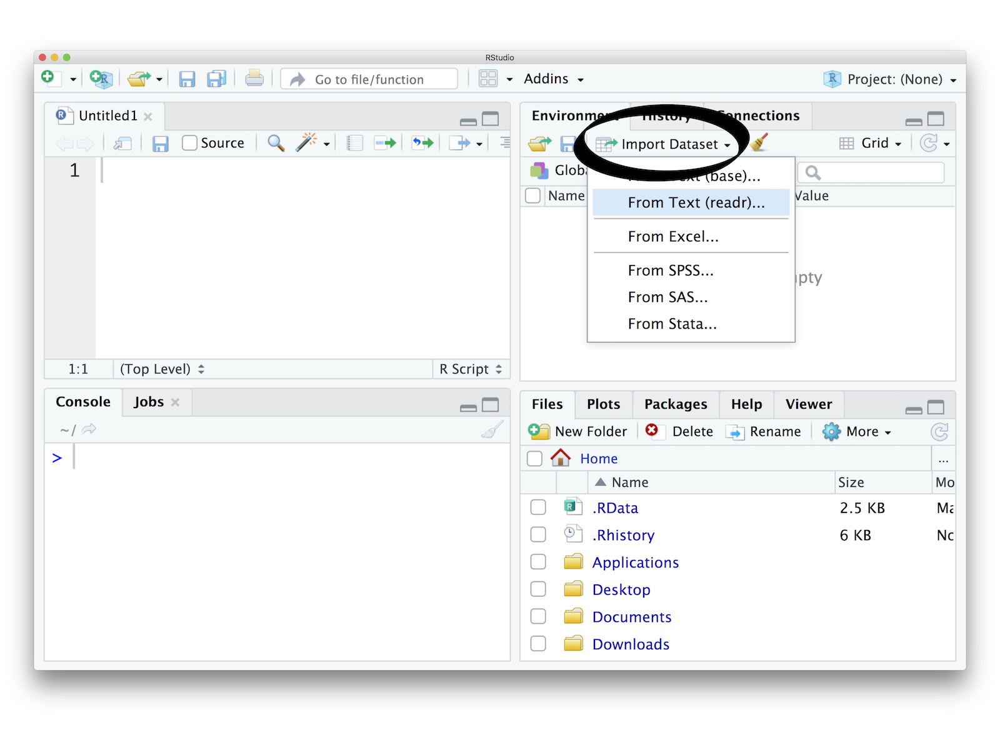
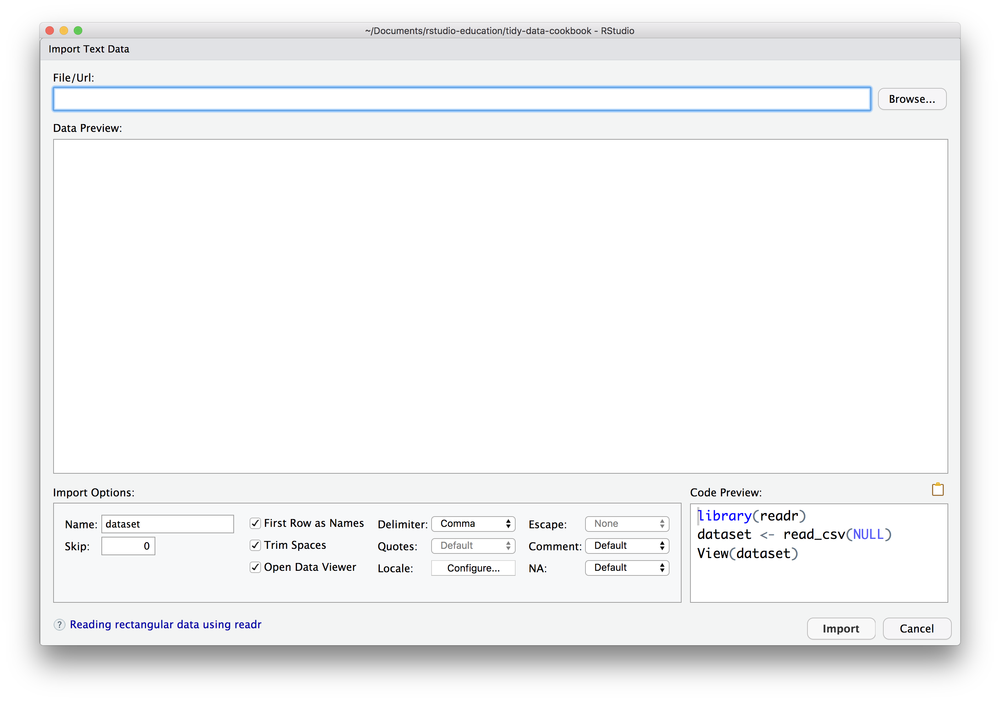

# Import

***

```{r echo = FALSE, results='asis'}
build_toc("02-import.Rmd")
```

***

## What you should know before you begin {-}

```{block2, type='rmdcaution'}
Before you can manipulate data with R, you need to import the data into R's memory, or build a connection that R can use to access the data remotely.
```

```{block2, type='rmdcaution'}
How you import data will depend on the format in which the data is stored. The most common way to store small data sets is as a plain text file. Data may also be stored in a proprietary format associated with a specific piece of software, such as SAS, SPSS, or Microsoft Excel. Data collected from the internet is often stored as a JSON file. Large data sets may be stored in a database or a distributed storage system.
```

```{block2, type='rmdcaution'}
R stores data in your computer's RAM while you manipulate it. This creates a size limitation: truly big data sets should be stored outside of R in a database or distributed storage system that R can connect to to manipulate the data.
```

## Import data quickly with a GUI

You want to import data quickly, and you do not mind using a semi-reproducible graphical user interface (GUI) to do so.

#### Solution {-}

```{r echo = FALSE, out.width = "80%"}

```

#### Discussion {-}

The RStudio IDE provides an Import Dataset button in the Environment pane, which appears in the top right corner of the IDE by default. You can use this button to import data that is stored in plain text files as well as in Excel, SAS, SPSS, and Stata files.

Click the button to launch a window that includes a file browser (below). Use the browser to select the file to import. 

```{r echo = FALSE, out.width = "80%"}

```

After you've selected a file, RStudio will display a preview of how the file will be imported as a data frame. Below the preview, RStudio provides a GUI interface to the common options for importing the type of file you have selected. As you customize the options, RStudio updates the data preview to display the results.

The bottom right-hand corner of the window displays the code that will reproduce your importation process programatically. You should copy and save this code if you wish to document your work in a reproducible workflow.