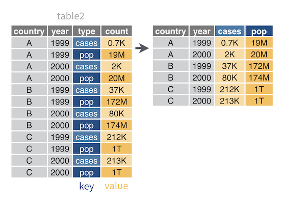
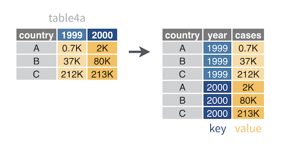
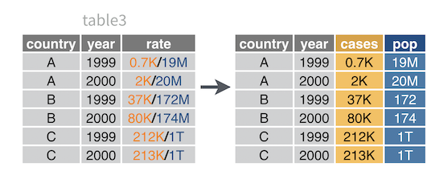
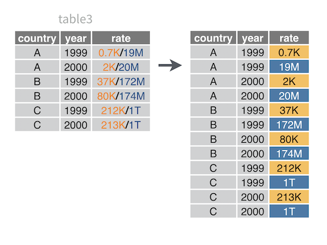
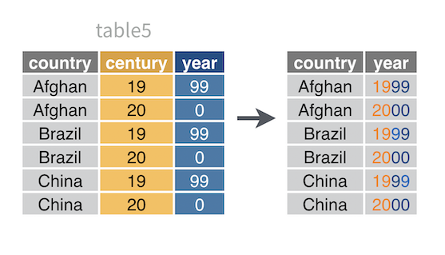

# Tidy

***

This chapter includes the following recipes:

```{r echo = FALSE, results='asis'}
build_toc("03-tidy.Rmd")
```

***

## What you should know before you begin {-}

```{block2, type='rmdcaution'}
Data tidying refers to reshaping your data into a tidy data frame or [tibble](#tidy-data). Data tidying is an important first step for your analysis because every tidyverse function will expect your data to be stored as **Tidy Data**. 

Tidy data is tabular data organized so that:

1. Each column contains a single variable
1. Each row contains a single observation

Tidy data is not an arbitrary requirement of the tidyverse; it is the ideal data format for doing data science with R. Tidy data makes it easy to extract every value of a variable to build a plot or to compute a summary statistic. Tidy data also makes it easy to compute new variables; when your data is tidy, you can rely on R's rowwise operations to maintain the integrity of your observations. Moreover, R can directly manipulate tidy data with R's fast, built-in vectorised observations, which lets your code run as fast as possible.

The definition of Tidy Data isn't complete until you define variable and observation, so let's borrow two definitions from [_R for Data Science_](https://r4ds.had.co.nz/exploratory-data-analysis.html):
  
1. A **variable** is a quantity, quality, or property that you can measure.
1. An **observation** is a set of measurements made under similar conditions (you usually make all of the measurements in an observation at the same time and on the same object).
 
As you work with data, you will be surprised to realize that what is a variable (or observation) will depend less on the data itself and more on what you are trying to do with it. With enough mental flexibility, you can consider anything to be a variable. However, some variables will be more useful than others for any specific task. In general, if you can formulate your task as an equation (math or code that contains an equals sign), the most useful variables will be the names in the equation.
```

## Create a tibble manually

You want to create a tibble from scratch by typing in the contents of the tibble.

#### Solution {-}

```{r}
tribble(~number, ~letter,   ~greek,
              1,     "a",  "alpha",
              2,     "b",   "beta",
              3,     "c",  "gamma")
```

#### Discussion {-}

`tribble()` creates a tibble and tricks you into typing out a preview of the result. To use `tribble()`, list each column name preceded by a `~`, then list the values of the tribble in a rowwise fashion. If you take care to align your columns, the transposed syntax of `tribble()` becomes a preview of the table.

You can also create a tibble with `tibble()`, whose syntax mirrors `data.frame()`:

```{r eval = FALSE}
tibble(number = c(1, 2, 3), 
       letter = c("a", "b", "c"),
       greek = c("alpha", "beta", "gamma"))
```


## Convert a data frame to a tibble

You want to convert a data frame to a tibble.

#### Solution {-}

```{r}
as_tibble(iris)
```

## Convert a tibble to a data frame

You want to convert a tibble to a data frame.

#### Solution {-}

```{r}
as.data.frame(table1)
```

#### Discussion {-}

```{block2, type = "rmdcaution"}
Be careful to use `as.data.frame()` and not `as_data_frame()`, which is an alias for `as_tibble()`.
```

## Preview the contents of a tibble

You want to get an idea of what variables and values are stored in a tibble.

#### Solution {-}

```{r}
storms
```

#### Discussion {-}

When you call a tibble directly, R will display enough information to give you a quick sense of the contents of the tibble. This includes:

1. the dimensions of the tibble
1. the column names and types
1. as many cells of the tibble as will fit comfortably in your console window

## Inspect every cell of a tibble

You want to see every value that is stored in a tibble.

#### Solution {-}

```{r eval = FALSE}
View(storms)
```

#### Discussion {-}

`View()` (with a capital V) opens the tibble in R's data viewer, which will let you scroll to every cell in the tibble.

## Spread a pair of columns into a field of cells

You want to **pivot**, **convert long data to wide**, or move variable names out of the cells and into the column names. These are different ways of describing the same action.

```{r echo = FALSE, fig.align = 'center'}

```

For example, `table2` contains `type`, which is a column that repeats the variable names `case` and `population`. To make `table2` tidy, you must move `case` and `population` values into their own columns.

```{r}
table2
```

#### Solution {-}

```{r}
table2 %>% 
  spread(key = type, value = count)
```

#### Discussion {-}

To use `spread()`, assign the column that contains variable names to `key`. Assign the column that contains the values that are associated with those names to `value`. `spread()` will:

1. Make a copy of the original table
1. Remove the `key` and `value` columns from the copy
1. Remove every duplicate row in the data set that remains
1. Insert a new column for each unique variable name in the `key` column 
1. Fill the new columns with the values of the `value` column in a way that preserves every relationship between values in the original data set

Since this is easier to see than explain, you may want to study the diagram above. 

Each new column created by `spread()` will inherit the data type of the `value` column. If you would to convert each new column to the most sensible data type given its final contents, add the argument `convert = TRUE`.

## Gather a field of cells into a pair of columns

You want to **convert wide data to long**, reshape a **two-by-two table**, or move variable values out of the column names and into the cells. These are different ways of describing the same action.

```{r echo = FALSE, fig.align = 'center'}

```

For example, `table4a` is a two-by-two table with the column names `1999` and `2000`. These names are values of a `year` variable. The field of cells in `table4a` contains counts of TB cases, which is another variable. To make `table4a` tidy, you need to move year and case values into their own columns. 

```{r}
table4a
```

#### Solution {-}

```{r}
table4a %>% 
  gather(key = "year", value = "cases", 2:3)
```

#### Discussion {-}

`gather()` is the inverse of `spread()`: `gather()` collapses a field of cells that spans several columns into two new columns:

1. A column of former "keys", which contains the column names of the former field
1. A column of former "values", which contains the cell values of the former field 

To use `gather()`, pick names for the new `key` and `value` columns, and supply them as strings. Then identify the columns to gather into the new key and value columns. `gather()` will:

1. Create a copy of the original table
1. Remove the identified columns from the copy
1. Add a key column with the supplied name
1. Fill the key column with the column names of the removed columns, repeating rows as necessary so that each combination of row and removed column name appears once
1. Add a value column with the supplied name
1. Fill the value column with the values of the removed columns in a way that preserves every relationship between values and column names in the original data set

Since this is easier to see than explain, you may want to study the diagram above. 

##### Identify columns to gather {-}

You can identify the columns to gather (i.e. remove) by:

1. name
1. index (numbers)
1. inverse index (negative numbers that specifiy the columns to _retain_, all other columns will be removed.)
1. the [`select()` helpers](https://dplyr.tidyverse.org/reference/select.html#useful-functions) that come in the dplyr package 

So for example, the following commands will do the same thing as the solution above:

```{r eval = FALSE}
table4a %>% gather(key = "year", value = "cases", `"1999", "2000")
table4a %>% gather(key = "year", value = "cases", -1)
table4a %>% gather(key = "year", value = "cases", one_of(c("1999", "2000")))
```

By default, the new key column will contain character strings. If you would like to convert the new key column to the most sensible data type given its final contents, add the argument `convert = TRUE`.

## Separate a column into new columns

You want to split a single column into multiple columns by separating each cell in the column into a row of cells. Each new cell should contain a separate portion of the value in the original cell.  

```{r echo = FALSE, fig.align = 'center'}

```

For example, `table3` combines `cases` and `population` values in a single column named `rate`. To tidy `table3`, you need to separate `rate` into two columns: one for the `cases` variable and one for the `population` variable.

```{r}
table3
```

#### Solution {-}

```{r}
table3 %>% 
  separate(col = rate, into = c("cases", "population"), 
           sep = "/", convert = TRUE)
```

#### Discussion {-}

To use `separate()`, pass `col` the name of the column to split, and pass `into` a vector of names for the new columns to split `col` into. You should supply one name for each new column that you expect to appear in the result; a mismatch will imply that something went wrong. 

`separate()` will:

1. Create a copy of the original data set
1. Add a new column for each value of `into`. The values will become the names of the new columns.
1. Split each cell of `col` into multiple values, based on the locations of a separator character.
1. Place the new values into the new columns in order, one value per column
1. Remove the `col` column. Add the argument `remove = FALSE` to retain the `col` column in the final result.

Since this is easier to see than explain, you may want to study the diagram above. 

Each new column created by `separate()` will inherit the data type of the `col` column. If you would like to convert each new column to the most sensible data type given its final contents, add the argument `convert = TRUE`.

##### Control where cells are separated {-}

By default, `separate()` will use non-alpha-numeric characters as a separators. Pass a regular expression to the `sep` argument to specify a different set of separators. Alternatively, pass an integer vector to the `sep` argument to split cells into sequences that each have a specific number of characters:

* `sep = 1` will split each cell between the first and second character. 
* `sep = c(1, 3)` will split each cell between the first and second character and then again between the third and fourth character.
* `sep = -1` will split each cell between the last and second to last character.

##### Separate into multiple rows {-}

`separate_rows()` behaves like `separate()` except that it places each new value into a new row (instead of into a new column).

```{r echo = FALSE, fig.align = 'center'}

```

To use `separate_rows()`, follow the same syntax as `separate()`.

## Unite multiple columns into a single column

You want to combine several columns into a single column by uniting their values across rows.

```{r echo = FALSE, fig.align = 'center'}

```

For example, `table5` splits the `year` variable across two columns: `century` and `year`. To make `table5` tidy, you need to unite `century` and `year` into a single column.

```{r}
table5
```

#### Solution {-}

```{r}
table5 %>% 
  unite(col = "year", century, year, sep = "")
```

#### Discussion {-}

To use `unite()`, give the `col` argument a character string to use as the name of the new column to create. Then list the columns to combine. Finally, give the `sep` argument a separator character to use to paste together the values in the cells of each column. `unite()` will:

1. Create a copy of the original data set
1. Paste together the values of the listed columns in a vectorized (i.e. rowwise) fashion. `unite()` will place the value of `sep` between each value during the paste process.
1. Append the results as a new column whose name is the value of `col`
1. Remove the listed columns. To retain the columns in the result, add the argument `remove = FALSE`.

Since this is easier to see than explain, you may want to study the diagram above. 

```{block2, type = "rmdcaution"}
If you do not suppy a `sep` value, `unite()` will use `_` as a separator character. To avoid a separator character, use `sep = ""`.
```