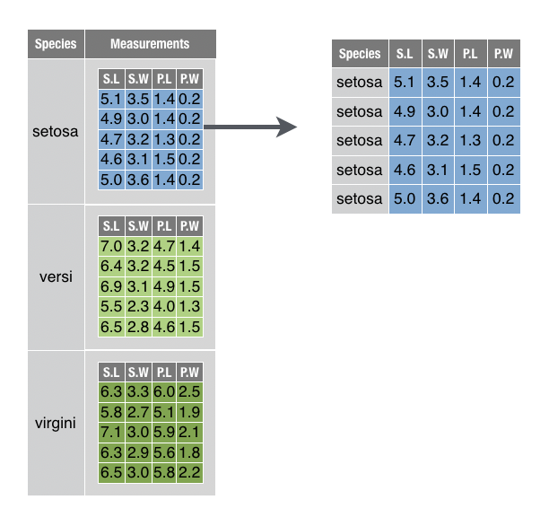
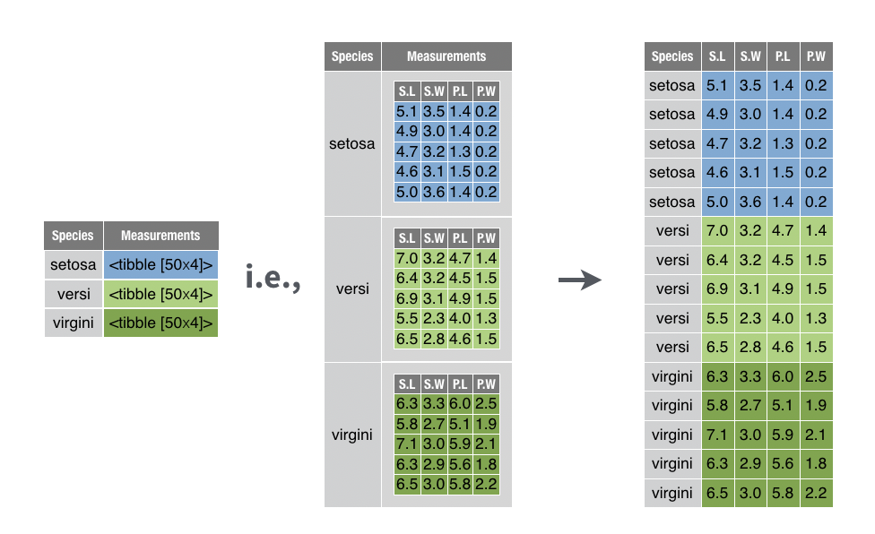

# Transform Tables

***

This chapter includes the following recipes:

```{r echo = FALSE, results='asis'}
build_toc("04-transform-tables.Rmd")
```

***

## What you should know before you begin {-}

```{block2, type='rmdcaution'}
The dplyr package provides the most important tidyverse functions for manipulating tables. These functions share some defaults that make it easy to transform tables:

1. dplyr functions always return a transformed _copy_ of your table. They won't change your original table unless you tell them to (by saving over the name of the original table). That's good news, because you should always retain a clean copy of your original data in case something goes wrong.

2. You can refer to columns by name inside of a dplyr function. There's no need for `$` syntax or `""`. Every dplyr function requires you to supply a data frame, and it will recognize the columns in that data frame, e.g.

    `summarise(mpg, h = mean(hwy), c = mean(cty))` 

    This only becomes a problem if you'd like to use an object that has the same name as one of the columns in the data frame. In this case, place `!!` before the object's name to unquote it, dplyr will skip the columns when looking up the object. e.g.
    
    `hwy <- 1:10`  
    `summarise(mpg, h = mean(!!hwy), c = mean(cty))` 

Transforming a table sometimes requires more than one recipe. Why? Because tables are made of multiple data structures that work together: 

1. The table itself is a data frame or tibble.  
1. The columns of the table are vectors.  
1. Some columns may be list-columns, which are lists that contain vectors.  

Each tidyverse function tends to focus on a single type of data structure; it is part of the tidyverse philosophy that each function should do one thing and do it well. 

So to transform a table, begin with a recipe that transforms the structure of the table. You'll find those recipes in this chapter. Then complete it with a recipe that transforms the actual data values in your table. The [Combine transform recipes] recipe will show you how. 
```

## Arrange rows by value in ascending order

You want to sort the rows of a data frame in **ascending** order by the values in one or more columns.

```{r echo = FALSE, fig.align='center'}
knitr::include_graphics("images/dplyr-arrange.png")
```

#### Solution {-}

```{r}
mpg %>% 
  arrange(displ)
```

#### Discussion {-}

`arrange()` sorts the rows according to the values of the specified column, with the lowest values appearing near the top of the data frame. If you provide additional column names, `arrange()` will use the additional columns in order as tiebreakers to sort within rows that share the same value of the first column.

```{r}
mpg %>% 
  arrange(displ, cty)
```

## Arrange rows by value in descending order

You want to sort the rows of a data frame in **descending** order by the values in one or more columns.

```{r echo = FALSE, fig.align='center'}
knitr::include_graphics("images/dplyr-desc.png")
```

#### Solution {-}

```{r}
mpg %>% 
  arrange(desc(displ))
```

#### Discussion {-}

Place `desc()` around a column name to cause `arrange()` to sort by descending values of that column. You can use `desc()` for tie-breaker columns as well (compare line nine below to the table above).

```{r}
mpg %>% 
  arrange(desc(displ), desc(cty))
```


## Filter rows with a logical test

You want to filter your table to just the rows that meet a specific condition.

```{r echo = FALSE, fig.align='center'}
knitr::include_graphics("images/dplyr-filter.png")
```

#### Solution {-}

```{r}
mpg %>% 
  filter(model == "jetta")
```

#### Discussion {-}

`filter()` takes a logical test and returns the rows for which the logical test returns `TRUE`. `filter()` will match column names that appear within the logical test to columns in your data frame. 

If you provide multiple logical tests, `filter()` will combine them with an AND operator (`&`):

```{r eval = FALSE}
mpg %>% 
  filter(model == "jetta", year == 1999)
```

Use R's boolean operators, like `|`and `!`, to create other combinations of logical tests to pass to filter. See the help pages for `?Comparison` and `?Logic` to learn more about writing logical tests in R.

## Select columns by name

You want to return a "subset" of columns from your data frame by listing the name of each column to return.

```{r echo = FALSE, fig.align='center'}
knitr::include_graphics("images/dplyr-select.png")
```

#### Solution {-}

```{r}
table1 %>% 
  select(country, year, cases)
```

<!-- I couldn't find table1 anywhere in a search, may want to provide code for people at the top to generate? Or at least cross-reference -->

#### Discussion {-}

`select()` returns a new data frame that includes each column passed to `select()`. Repeat a name to include the column twice.

## Drop columns by name

You want to return a "subset" of columns from your data frame by listing the name of each column to drop.

```{r echo = FALSE, fig.align='center'}
knitr::include_graphics("images/dplyr-select-drop.png")
```

#### Solution {-}

```{r}
table1 %>% 
  select(-c(population, year))
```

#### Discussion {-}

If you use a `-` before a column name, `select()` will return every column in the data frame except that column. To drop more than one column at a time, group the columns into a vector preceded by `-`. 

## Select a range of columns

You want to return two columns from a data frame as well as every column that appears between them. 

```{r echo = FALSE, fig.align='center'}
knitr::include_graphics("images/dplyr-select-range.png")
```

#### Solution {-}

```{r}
table1 %>% 
  select(country:cases)
```

#### Discussion {-}

If you combine two column names with a `:`, `select()` will return both columns and every column that appears between them in the data frame.

## Select columns by integer position

You want to return a "subset" of columns from your data frame by listing the position of each column to return.

#### Solution {-}

```{r}
table1 %>% 
  select(1, 2, 4)
```

#### Discussion {-}

`select()` interprets the whole number _n_ as the _n_th column in the data set. You can combine numbers with `-` and `:` inside of `select()` as well.

## Select columns by start of name

You want to return evey column in your data that begins with a specific string.

#### Solution {-}

```{r}
table1 %>% 
  select(starts_with("c"))
```

## Select columns by end of name

You want to return evey column in your data that ends with a specific string.

#### Solution {-}

```{r}
table1 %>% 
  select(ends_with("tion"))
```

## Select columns by string in name

You want to return evey column in your data whose name contains a specific string or regular expression.

#### Solution {-}

```{r}
table1 %>% 
  select(matches("o.*u"))
```

#### Discussion {-}

`o.*u` is a regular expression that matches an `o` followed by a `u` with any number of characters in between. `country` and `population` are returned because the names `country` and `population` each contain an `o` followed (at any distance) by a `u`.

See the help page for `?regex` to learn more about regular expressions in R.

## Reorder columns

You want to return all of the columns in the original data frame in a new order.

```{r echo = FALSE, fig.align='center'}
knitr::include_graphics("images/dplyr-select-reorder.png")
```

#### Solution {-}

```{r}
table1 %>% 
  select(country, year, population, cases)
```

#### Discussion {-}

Use `select()` to select all of the columns. List the column names in the new order.

## Reorder columns without naming each

You want to reorder some of the columns in the original data frame, but you don't care about the order for other columns, and you may have too many columns to name them each individually.

```{r echo = FALSE, fig.align='center'}
knitr::include_graphics("images/dplyr-select-everything.png")
```

#### Solution {-}

```{r}
table1 %>% 
  select(country, year, everything())
```

#### Discussion {-}

Use `everything()` within `select()` to select all of the columns in the order they are named: all columns are kept, and no columns are duplicated. Using `everything()` preserves the original ordering of the original (unnamed) columns.

## Rename columns

You want to rename one or more columns in your data frame, retaining the rest.

```{r echo = FALSE, fig.align='center'}
knitr::include_graphics("images/dplyr-rename.png")
```

#### Solution {-}

```{r}
table1 %>% 
  rename(state = country, date = year)
```

#### Discussion {-}

For each column to be renamed, type a new name for the column and set it equal to the old name for the column.

## Return the contents of a column as a vector

You want to return the contents of a single column as a vector, not as a data frame with one column.

```{r echo = FALSE, fig.align='center'}
knitr::include_graphics("images/dplyr-pull.png")
```

#### Solution {-}

```{r}
table1 %>% 
  pull(cases)
```


#### Discussion {-}

`pull()` comes in the dplyr package. It does the equivalent of `pluck()` in the purrr package; however, `pull()` is designed to work specifically with data frames. `pluck()` is designed to work with all types of lists. 

You can also pull a column by integer position:

```{r}
table1 %>% 
  pull(3)
```

## Mutate data (Add new variables)

You want to compute one or more new variables and add them to your table as columns.

```{r echo = FALSE, fig.align='center'}
knitr::include_graphics("images/dplyr-mutate.png")
```

#### Solution {-}

```{r}
table1 %>% 
  mutate(rate = cases/population, percent = rate * 100)
```

#### Discussion {-}

To use `mutate()`, pass it a series of names followed by R expressions. `mutate()` will return a copy of your table that contains one column for each name that you pass to `mutate()`. The name of the column will be the name that you passed to `mutate()`; the contents of the column will be the result of the R expression that you assigned to the name. The R expression should always return a vector of the same length as the other columns in the data frame,^[Or one that can be made the same length with R's recycling rules, e.g. a vector of length one.] because `mutate()` will add the vector as a new column.

```{r echo = FALSE, fig.align='center'}
knitr::include_graphics("images/dplyr-vectorized-functions.png")
```

In other words, `mutate()` is intended to be used with _vectorized functions_, which are functions that take a vector of values as input and return a new vector of values as output (e.g `abs()`, `round()`, and all of R's math operations).

`mutate()` will build the columns in the order that you define them. As a result, you may use a new column in the column definitions that follow it.

##### Dropping the original data {-}

Use `transmute()` to return only the new columns that `mutate()` would create.

```{r}
table1 %>% 
  transmute(rate = cases/population, percent = rate * 100)
```


## Summarise data

You want to compute summary statistics for the data in your data frame.

```{r echo = FALSE, fig.align='center'}
knitr::include_graphics("images/dplyr-summarise.png")
```

#### Solution {-}

```{r}
table1 %>% 
  summarise(total_cases = sum(cases), max_rate = max(cases/population))
```

#### Discussion {-}

To use `summarise()`, pass it a series of names followed by R expressions. `summarise()` will return a new tibble that contains one column for each name that you pass to `summarise()`. The name of the column will be the name that you passed to `summarise()`; the contents of the column will be the result of the R expression that you assigned to the name. The R expression should always return a single value because `summarise()` will always return a 1 x n tibble.^[`summarise()` will return a larger tibble if you pair it with `group_by()`.]

```{r echo = FALSE, fig.align='center'}
knitr::include_graphics("images/dplyr-summary-functions.png")
```

In other words, `summarise()` is intended to be used with _summary functions_, which are functions that take a vector of values as input and return a single value as output (e.g `sum()`, `max()`, `mean()`). In normal use, `summarise()` will pass each function a column (i.e. vector) of values and expect a single value in return.

`summarize()` is an alias for `summarise()`.

## Group data

You want to assign the rows of your data to subgroups based on their shared values or their shared combinations of values. 

```{r echo = FALSE, fig.align='center'}
knitr::include_graphics("images/dplyr-groups.png")
```

You want to do this as the first step in a multi-step analysis, because grouping data doesn't do anything noticeable until you pass the grouped data to a tidyverse function.

#### Solution {-}

```{r}
table1 %>% 
  group_by(country)
```

#### Discussion {-}

`group_by()` converts your data into a grouped tibble, which is a tibble subclass that indicates in its attributes^[Attributes are metadata associated with a data structure. R can see an object's attributes, but users typically cannot.] which rows belong to which group.

To group rows by the values of a single column, pass `group_by()` a single column name. To group rows by the unique _combination_ of values across multiple columns, pass `group_by()` the names of two or more columns.

##### Group-wise operations {-}

Where appropriate, tidyverse functions recognize grouped tibbles. Tidyverse functions: 

1. treat each group as a distinct data set
1. execute their code separately on each group
1. combine the results into a new data frame that contains the same grouping characteristics. `summarise()` is a slight exception, see below.

## Summarise data by groups

You want to compute summary statistics for different subgroups of data in your grouped data frame. 

```{r echo = FALSE, fig.align='center'}
knitr::include_graphics("images/dplyr-group_by.png")
```

#### Solution {-}

```{r}
table1 %>% 
  group_by(country) %>% 
  summarise(total_cases = sum(cases), max_rate = max(cases/population))
```

#### Discussion {-}

Group-wise summaries are the most common use of grouped data. When you apply `summarise()` to grouped data, `summarise()` will:

1. treat each group as a distinct data set
1. compute separate statistics for each group
1. combine the results into a new tibble

    ```{block2, type='rmdcaution'}
    Since this is easier to see than explain, you may want to     study the diagram and result above. 
    ```

`summarise()` gives grouped data special treatment in two ways:

1. `summarise()` will retain the column(s) that were used to group the data in its result. This makes the output of grouped summaries interpretable. 

2. `summarise()` will shorten the grouping criteria of its result by one column name (the last column name). Compare this to other tidyverse functions which give their result the _same_ grouping criteria as their input. 

    For example, if the input of `summarise()` is grouped by `country` and `year`, the output of `summarise()` will only be grouped by `country`. Because of this, you can call `summarise()` repeatedly to view progressively higher level summaries:

```{r}
table1 %>% 
  group_by(country, year) %>% 
  summarise(total_cases = sum(cases))
```

```{r}
table1 %>% 
  group_by(country, year) %>% 
  summarise(total_cases = sum(cases)) %>% 
  summarise(total_cases = sum(total_cases))
```

```{r}
table1 %>% 
  group_by(country, year) %>% 
  summarise(total_cases = sum(cases)) %>% 
  summarise(total_cases = sum(total_cases)) %>% 
  summarise(total_cases = sum(total_cases))
```

## Nest a data frame

You want to move portions of your data frame into their own tables, and then store those tables in cells in your original data frame. 

```{r echo = FALSE, fig.align='center'}
knitr::include_graphics("images/tidyr-nest.png")
```

This lets you manipulate the collection of tables with `filter()`, `select()`, `arrange()`, and so on, as you would normally manipulate a collection of values.

#### Solution {-}

```{r}
iris %>% 
  group_by(Species) %>% 
  nest(.key = "Measurements")
```


#### Discussion {-}

`nest()` comes in the tidyr package. You can use it to nest portions of your data frame in two ways:

1. Pass `nest()` a _grouped data frame_ made with `dplyr::group_by()` (as above). `nest()` will create a separate table for each group. The table will contain every row in the group and every column that is not part of the grouping criteria.

2. Pass `nest()` an ungrouped data frame and then specify which columns to nest. `nest()` will perform an implicit grouping on the combination of values that appear across the remaining columns, and then create a separate table for each implied grouping. 

    You can specify columns with the same syntax and helpers that you would use with dplyr's `select()` function. So, for example, the two calls below will produce the same result as the solution above.

    ```{r eval = FALSE}
    iris %>% 
      nest(Sepal.Width, 
           Sepal.Length, 
           Petal.Width, 
           Petal.Length, 
           .key = "Measurements") %>% 
      as_tibble()
    
    iris %>% 
      nest(-Species, .key = "Measurements") %>% 
      as_tibble()
    ```
    
`nest()` preserves class, which means that `nest()` will return a data frame if its input is a data frame and a tibble if its input is a tibble. In each case, `nest()` will add the subtables to the result as a list-column. Since, list-columns are much easier to view in a tibble than a data frame, I recommend that you convert the result of `nest()` to a tibble when necessary.

Use the `.key` argument to provide a name for the new list-column.

## Extract a table from a nested data frame

You want to extract a single table nested within a data frame.

```{r echo = FALSE, fig.align='center'}

```

For example, you want to extract the setosa table from the nested data set created in the solution above,

```{r}
nested_iris <-
  iris %>% 
  group_by(Species) %>% 
  nest(.key = "Measurements")
```

#### Solution {-}

```{r}
nested_iris %>% 
  filter(Species == "setosa") %>% 
  unnest()
```


#### Discussion {-}

Since the table is in a cell of the data frame, it is possible to extract the table by extracting the contents of the cell (as below). Be sure to use double brackets to extract the content itself, and not a 1 x 1 data frame that contains the cell.

```{r eval = FALSE}
nested_iris[[1, 2]]
```

However, this approach can be suboptimal for nested data. Often a nested table relies on information that is stored alongside it for meaning. For example, in the above example, the table relies on the Species variable to indicate that it describes setosa flowers.

You can extract a nested table along with its related information by first subsetting to just the relevant information and then unnesting the result.

## Unnest a data frame

You want to transform a nested data frame into a flat data frame by re-integrating the nested tables into the surrounding data frame.

```{r echo = FALSE, fig.align='center'}

```

For example, you want to unnest the `nested_iris` data frame created in the recipe above,

```{r}
nested_iris <-
  iris %>% 
  group_by(Species) %>% 
  nest(.key = "Measurements")
```

#### Solution {-}

```{r}
unnest(nested_iris)
```

#### Discussion {-}

`unnest()` converts a list-column into a regular column or columns, repeating the surrounding rows as necessary. `unnest()` can handle list columns that contain atomic vectors and data frames, but cannot handle list columns that contain objects that would not naturally fit into a data frame, such as model objects.

By default, `unnest()` will unnest every list-column in a data frame. To unnest only a subset of list-columns, pass the names of the list-columns to `unnest()` using dplyr `select()` syntax or helpers. `unnest()` will ignore unnamed list columns, excluding them from the result to return a flat data frame. `unnest()` comes in the tidyr package. 

<!-- 
Unnest a data frame
Create a list-column
Transform a list-column
Simplify a list-column

You want to

#### Solution {-}

#### Discussion {-}
-->


## Combine transform recipes

You want to transform the structure of a table, and you want to use the data within the table to do it. This is the sort of thing you do everytime you call `summarise()` or `mutate()`.

#### Solution {-}

See the discussion.

#### Discussion {-}

When you transform a data frame, you often work with several functions:

1. A function that transforms the _table_ itself, adding columns to its structure, or building a whole new table to hold results.

1. A function that transforms the values held in the table. Since values are always held in vectors (here column vectors), this function transforms a _vector_ to create a new vector that can then be added to the empty column or table created by function 1.

1. A function that mediates between 1 and 2 if the values are embedded in a list-column, which is a _list_.

The most concise way to learn how to combine these functions is to learn about the functions in isolation, and to then have the functions call each other as necessary.

##### An example {-}

`smiths` contains measurements that describe two fictional people: John and Mary Smith.

```{r}
smiths
```

To round the `height` value for each person, you would need two functions:

1. `round()` which can round the values of the data vector stored in `smiths$height`.

```{r}
round(smiths$height)
```

2. `mutate()` which can add the results to a copy of the `smiths` table. 

```{r}
smiths %>% 
  mutate(height_int = round(height))
```

`round()` works with data vectors. `mutate()` works with tables. Together they create the table you want.

##### An example that uses list columns {-}

`sepals` is a tibble that I made for this example.^[I made this data frame with the code `sepals <- iris %>% 
  group_by(Species) %>% 
  summarise(lengths = list(Sepal.Length))`] It contains sepal length measurements for three species of flowers. The measurements are stored in a list-column named `lengths`.

```{r echo = FALSE}
sepals <- iris %>% 
  group_by(Species) %>% 
  summarise(lengths = list(Sepal.Length))
```

```{r}
sepals
```

Each cell in `lengths` contains a data vector of 50 sepal lengths.

```{r}
# For example, the first cell of lengths
sepals[[1, 2]]
```

To add the average sepal length for each species to the table, you would need three functions:

1. `mean()` which can compute the average of a data vector in `lengths`

    ```{r}
    mean(sepals[[1, 2]])
    ```
    
2. `map_dbl()` which can apply `mean()` to each cell of `lengths`, which is a list-column.

    ```{r}
    map_dbl(sepals$lengths, mean)
    ```

3. `mutate()` which can add the results to a copy of the `sepals` table. 

    ```{r}
    sepals %>% 
      mutate(avg_length = map_dbl(lengths, mean))
    ```

`mean()` works with data vectors. `map_dbl()` works with list-columns. `mutate()` works with tables. Together they create the table you want.


## Join data sets by common column(s) {#joins}

You want to combine two data frames into a single data frame, such that observations in the first data frame are matched to the corresponding observations in the second data frame, even if those observations do not appear in the same order. 

Your data is structured in such a way that you can match observations by the values of one or more ID columns that appear in both data frames. 

```{r echo = FALSE, fig.align='center'}
knitr::include_graphics("images/dplyr-left-join.png")
```

For example, you would like to combine `band_members` and `band_instruments` into a single data frame based on the values of the `name` column. The new data frame will correctly list who plays what.

```{r}
band_members
```

```{r}
band_instruments
```

#### Solution {-}

```{r}
band_members %>% 
  left_join(band_instruments, by = "name")
```

#### Discussion {-}

There are four ways to join content from one data frame to another. Each uses a different function name, but the same arguments and syntax. Of these, `left_join()` is the most common.

1. `left_join()` drops any row in the _second_ data set does not match a row in the first data set. (It retains every row in the first data set, which appears on the left when you type the function call, hence the name).

    ```{r echo = FALSE, fig.align='center'}
    knitr::include_graphics("images/dplyr-left-join.png")
    ```

1. `right_join()` drops any row in the _first_ data set does not match a row in the first data set.

    ```{r echo = FALSE, fig.align='center'}
    knitr::include_graphics("images/dplyr-right-join.png")
    ```

    ```{r}
    band_members %>% 
      right_join(band_instruments, by = "name")
    ```
    
1. `inner_join()` drops any row in _either_ data set that does not have a match in both data sets, i.e. `inner_join()` does not retain any incomplete rows in the final result. 

    ```{r echo = FALSE, fig.align='center'}
    knitr::include_graphics("images/dplyr-inner-join.png")
    ```

    ```{r}
    band_members %>% 
      inner_join(band_instruments, by = "name")
    ```
    
1. `full_join()` retains every row from both data sets; it is the only join guaranteed to retain all of the original data. 

    ```{r echo = FALSE, fig.align='center'}
    knitr::include_graphics("images/dplyr-full-join.png")
    ```

    ```{r}
    band_members %>% 
      full_join(band_instruments, by = "name")
    ```

##### Mutating joins {-}

`left_join()`, `right_join()`, `inner_join()`, and `full_join()` are collectively called _mutating joins_ because they add additional columns to a copy of a data set, as does `mutate()`.

##### Specifying column(s) to join on {-}

By default, the mutating join functions will join on the set of columns whose names appear in both data frames. The join functions will match each row in the first data frame to the row in the second data frame that has the same combination of values across the commonly named columns.

To override the default, add a `by` argument to your join function. Pass it the name(s) of the column(s) to join on as a character vector. These names should appear in both data sets. R will join together rows that contain the same combination of values in these columns, ignoring the values in other columns, even if those columns share a name with a column in the other data frame.

```{r}
table1 %>% 
  left_join(table3, by = c("country", "year"))
```


##### Joining when ID names do not match {-}

Often an ID variable will appear with a different name in each data frame. For example, the `name` variable appears as `artist` in `band_instruments2`. 

```{r}
band_instruments2
```

To join by two columns that have different names, pass `by` a named character vector: each element of the vector should be a pair of names, e.g. 

```{r eval = FALSE}
c(name1 = "name2", name4 = "name4")
```

For each element,

1. Write the name of the column that appears in the first data frame
2. Write an equals sign
3. Write the name of the matching column that appears in the second data set.

Only the second name needs to be surrounded with quotation marks. The join will match the corresponding columns across data frames.

```{r}
band_members %>% 
  left_join(band_instruments2, by = c(name = "artist"))
```

R will use the column name(s) from the first data set in the result.

##### Suffixes {-}

Joins will append the suffixes `.x` and `.y` to any columns that have the same name in both data sets _but are not used to join on_. The columns from the first data set are suffixed with `.x`, the columns from the second with `.y`. 

```{r}
table4a %>% 
  left_join(table4b, by = "country")
```

To use different suffixes, supply a character vector of length two as a `suffix` argument.

```{r}
table4a %>% 
  left_join(table4b, by = "country", suffix = c("_cases", "_pop"))
```

## Find rows that have a match in another data set

You want to find the rows in one data frame that have a match in a second data frame. By match, you mean that both rows refer to the same observation, even if they include different measurements. 

Your data is structured in such a way that you can match rows by the values of one or more ID columns that appear in both data frames. 

```{r echo = FALSE, fig.align='center'}
knitr::include_graphics("images/dplyr-semi-join.png")
```

For example, you would like to return the rows of `band_members` that have a corresponding row in `band_instruments`. The new data frame will be a reduced version of `band_members` that does not contain any new columns.

```{r}
band_members
```

```{r}
band_instruments
```

#### Solution {-}

```{r}
band_members %>% 
  semi_join(band_instruments, by = "name")
```

#### Discussion {-}

`semi_join()` returns only the rows of the first data frame that _have_ a match in the second data frame. A match is a row that would be combined with the first row by a [mutating join](#joins). This makes `semi_join()` a useful way to preview which rows will be retained by a mutating join.

`semi_join()` uses the same syntax as mutating joins. Learn more in [Specifying column(s) to join on] and [Joining when ID names do not match]. 

##### Filtering joins {-} 

`semi_join()` and `anti_join()` (see below) are called _filtering joins_ because they filter a data frame to only those rows that meet a specific criteria, as does `filter()`. 

Unlike mutating joins, filtering joins do not add columns from the second data frame to the first. Instead, they use the second data frame to identify rows to return from the first.

When you need to filter on a complicated set of conditions, filtering joins can be more effective than `filter()`: use `tribble()` to create a data frame to filter against with a filtering join.

## Find rows that do not have a match in another data set

You want to find the rows in one data frame that _do not_ have a match in a second data frame. By match, you mean that both rows refer to the same observation, even if they include different measurements. 

Your data is structured in such a way that you can match rows by the values of one or more ID columns that appear in both data frames.

```{r echo = FALSE, fig.align='center'}
knitr::include_graphics("images/dplyr-anti-join.png")
```

For example, you would like to return the rows of `band_members` that do not have a corresponding row in `band_instruments`. The new data frame will be a reduced version of `band_members` that does not contain any new columns.

```{r}
band_members
```

```{r}
band_instruments
```

#### Solution {-}

```{r}
band_members %>% 
  anti_join(band_instruments, by = "name")
```

#### Discussion {-}

`anti_join()` returns only the rows of the first data frame that _do not have_ a match in the second data frame. A match is a row that would be combined with the first row by a [mutating join](#joins). This makes `ant_join()` a useful way to debug a mutating join.

`anti_join()` provides a useful way to check for typos that could interfere with a mutating join; these rows will not have a match in the second data frame (assuming that the typo does not also appear in the second data frame). 
    
`anti_join()` also highlights entries that are coded in different ways across data frames, such as `"North_Carolina"` and `"North Carolina"`.

`anti_join()` uses the same syntax as mutating joins. Learn more in [Specifying column(s) to join on] and [Joining when ID names do not match]. Along with `semi_join()`, `anti_join()` is one of the two [Filtering joins].

    


